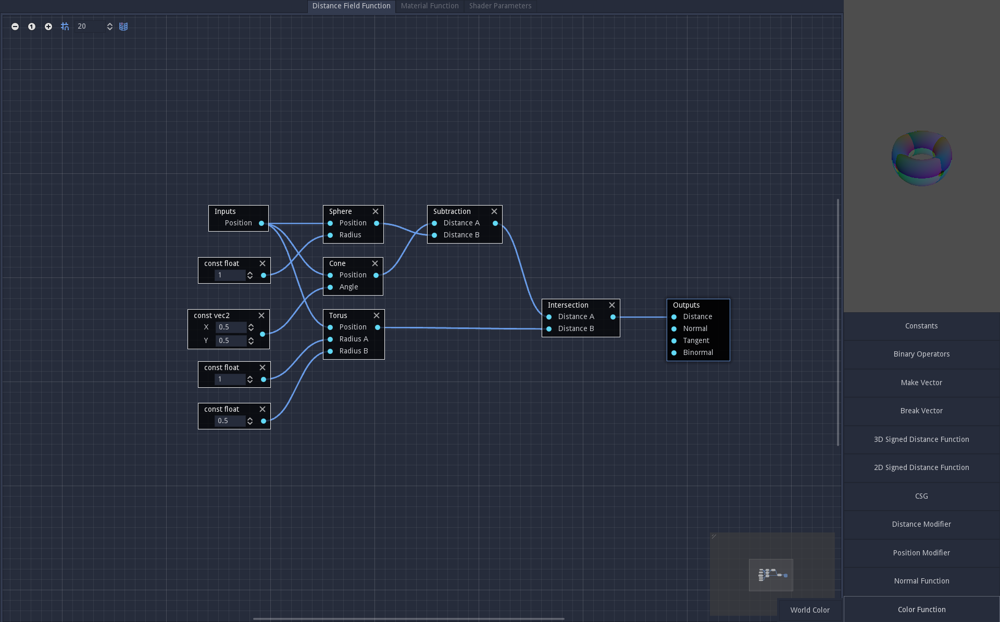
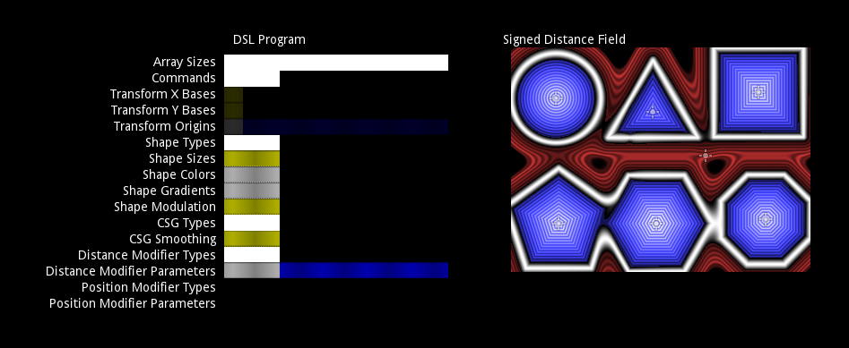
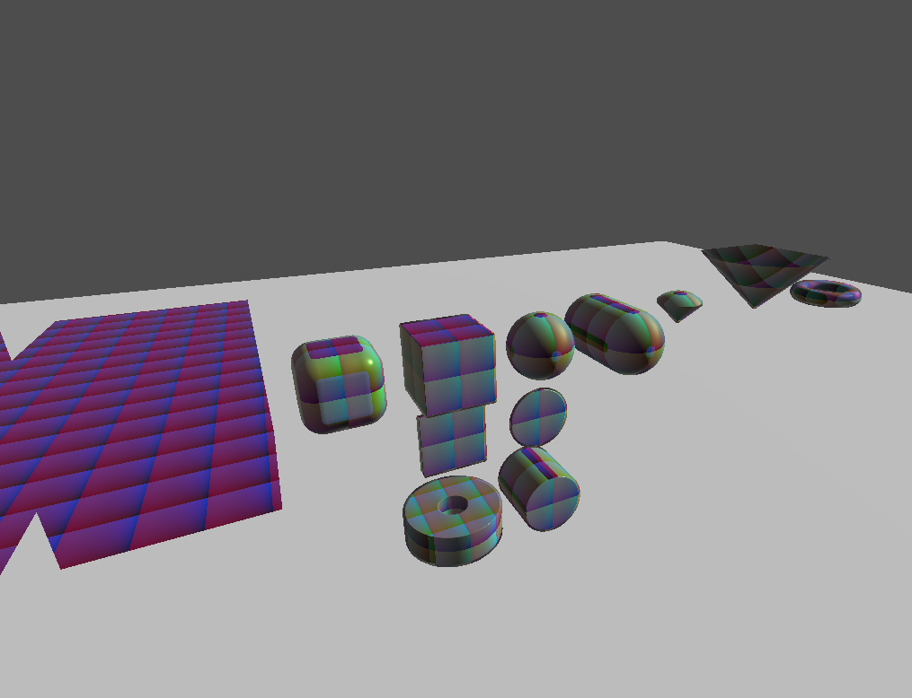

Godot editor extension for defining analytical signed distance field geometry via node graphs, and raymarching it on the GPU.
Encodes the fields as bytecode, which is transferred to the GPU via data texture and interpreted in-shader.

